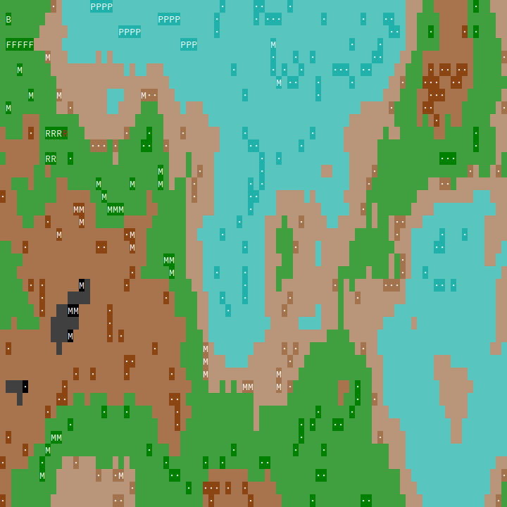
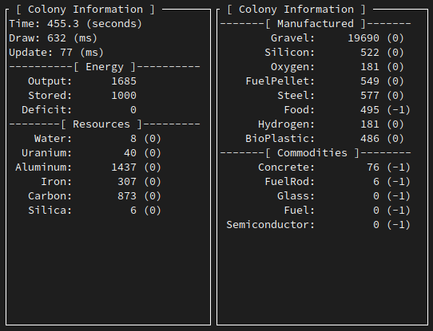
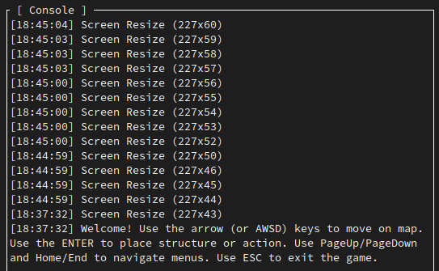
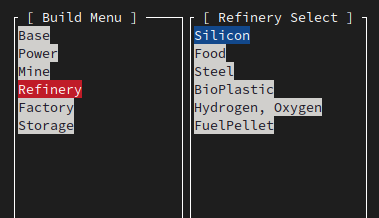

# Exo Colony
A real-time simulation game about building a colony on an exo-planet for terminal lovers.

## Screenshots

### Map with resources and built structures

### Colony information widgets

### Console / Log

### Build menu with structures and variants

## Alpha Roadmap
This game is currently in the *alpha* stage.
We will move to *beta* once all game mechanics will be implemented.
 
### Implemented

* Rendering loop
* Interface layouts
* Dynamic map and height map (perlin noise)
* Structure placement
* Energy management and requirements  
* Resource management and requirements
* Commodity management and requirements
* Structure components
* Tile info panel
* Implement structure building placement restrictions

### TODO
* Implement structure construction status (?)
* Implement money (ExoCoin) and revenue
* Implement spaceport structure
* Implement building activity and indicator

## Beta Roadmap
...